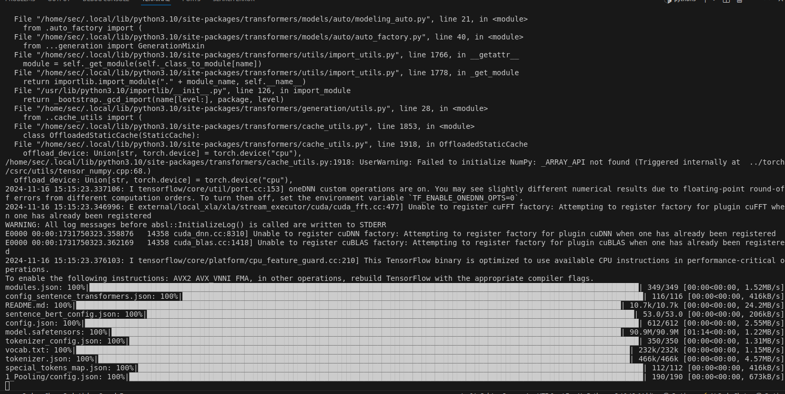
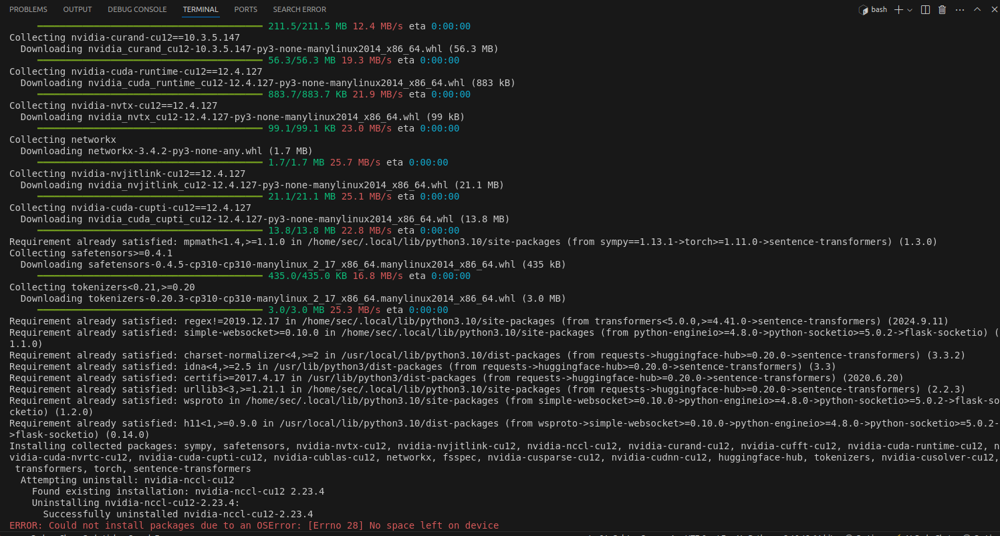
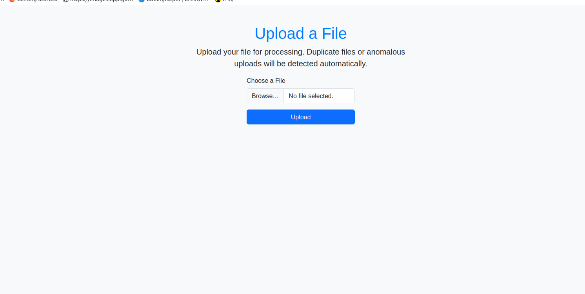
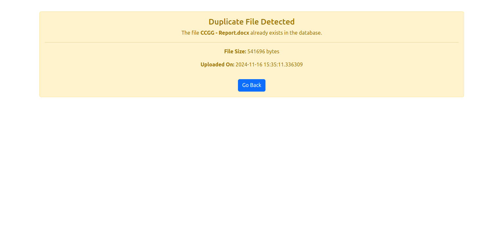

<<<<<<< HEAD
# Data-Duplication-Alert-System
=======
# Data Download Duplication Alert System (DDAS) 
# Author: IPsqSoftTech
# Date: On Going
# Version: 1.0
# Description: 
This script is designed to monitor the data download process and alert the user if there is any duplication in the downloaded data.

This advanced setup leverages **BERT** for similarity, **Autoencoders** for anomaly detection, and file type classification for customization. 
## Installing Required Libraries

Install the necessary dependencies for the new ML models and Flask:

```bash
pip install Flask flask-sqlalchemy flask-socketio scikit-learn numpy
```

```bash
pip install Flask Flask-SQLAlchemy flask-socketio numpy
```
```bash
pip install flask flask-sqlalchemy flask-cors hashlib
```

```bash
pip install eventlet
```

# uploads/ (Uploaded files directory)


```bash
mkdir uploads
```

### You can set the permissions using the following command:
```bash
chmod 755 uploads/
```

# 5. Additional Suggestions:

- **Model Retraining:** Implement a way to periodically retrain your anomaly detection model and similarity model to improve their performance as new data is collected.
- **Improved Logging:** Enhance error handling and logging for better traceability, using tools like **Sentry** or **Loggly**.
- **Model Deployment:** If the models grow large or require significant resources, consider deploying them using a model server (e.g., **TensorFlow Serving, TorchServe**).








>>>>>>> 864b64c (Updatted code for DDAS)
